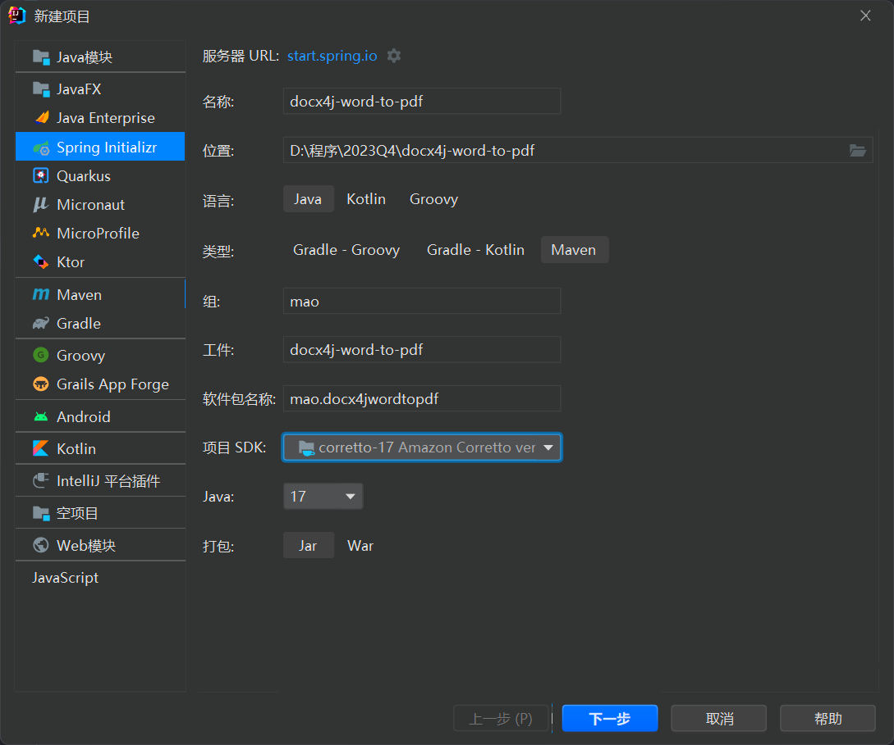
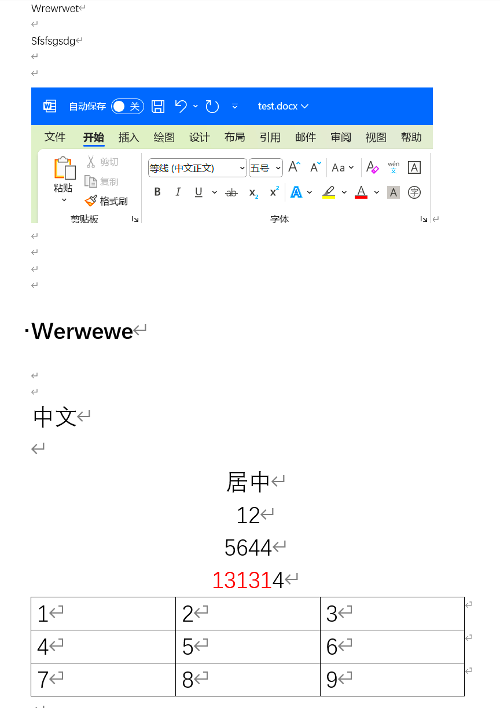
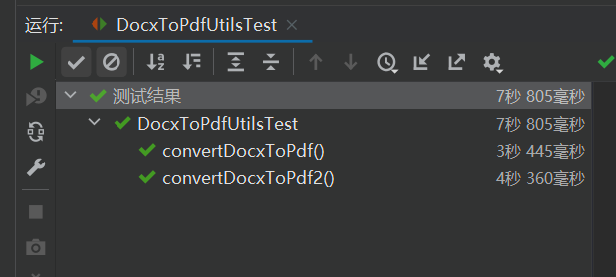
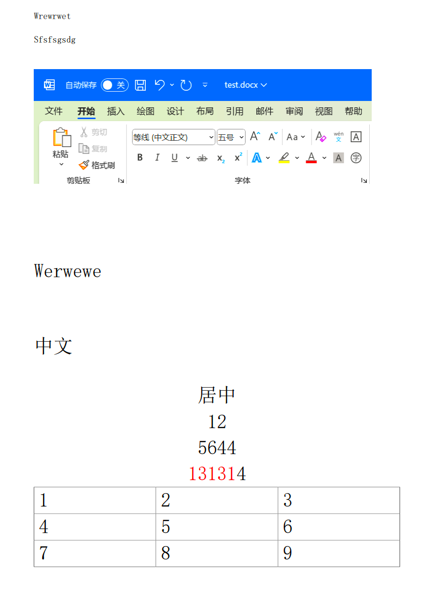

# docx4j实现

## 使用


创建项目：




pom文件依赖如下：

```xml
<?xml version="1.0" encoding="UTF-8"?>
<project xmlns="http://maven.apache.org/POM/4.0.0" xmlns:xsi="http://www.w3.org/2001/XMLSchema-instance"
         xsi:schemaLocation="http://maven.apache.org/POM/4.0.0 https://maven.apache.org/xsd/maven-4.0.0.xsd">
    <modelVersion>4.0.0</modelVersion>
    <parent>
        <groupId>org.springframework.boot</groupId>
        <artifactId>spring-boot-starter-parent</artifactId>
        <version>2.7.1</version>
        <relativePath/> <!-- lookup parent from repository -->
    </parent>
    <groupId>mao</groupId>
    <artifactId>docx4j-word-to-pdf</artifactId>
    <version>0.0.1-SNAPSHOT</version>
    <name>docx4j-word-to-pdf</name>
    <description>docx4j-word-to-pdf</description>

    <properties>
        <java.version>17</java.version>
    </properties>

    <dependencies>
        <dependency>
            <groupId>org.springframework.boot</groupId>
            <artifactId>spring-boot-starter</artifactId>
        </dependency>

        <dependency>
            <groupId>org.springframework.boot</groupId>
            <artifactId>spring-boot-starter-test</artifactId>
            <scope>test</scope>
        </dependency>

        <dependency>
            <groupId>org.docx4j</groupId>
            <artifactId>docx4j-JAXB-Internal</artifactId>
            <version>8.3.1</version>
        </dependency>
        <dependency>
            <groupId>org.docx4j</groupId>
            <artifactId>docx4j-JAXB-ReferenceImpl</artifactId>
            <version>8.3.1</version>
        </dependency>
        <dependency>
            <groupId>org.docx4j</groupId>
            <artifactId>docx4j-export-fo</artifactId>
            <version>8.3.1</version>
        </dependency>

    </dependencies>

    <build>
        <plugins>
            <plugin>
                <groupId>org.springframework.boot</groupId>
                <artifactId>spring-boot-maven-plugin</artifactId>
            </plugin>
        </plugins>
    </build>

</project>
```


编写工具类：

```java
package mao.docx4jwordtopdf.utils;

import org.apache.commons.compress.utils.IOUtils;
import org.docx4j.Docx4J;
import org.docx4j.fonts.IdentityPlusMapper;
import org.docx4j.fonts.Mapper;
import org.docx4j.fonts.PhysicalFont;
import org.docx4j.fonts.PhysicalFonts;
import org.docx4j.openpackaging.packages.WordprocessingMLPackage;
import org.slf4j.Logger;
import org.slf4j.LoggerFactory;

import javax.servlet.http.HttpServletResponse;
import java.io.File;
import java.io.FileOutputStream;
import java.util.UUID;

/**
 * Project name(项目名称)：docx4j-word-to-pdf
 * Package(包名): mao.docx4jwordtopdf.utils
 * Class(类名): DocxToPdfUtils
 * Author(作者）: mao
 * Author QQ：1296193245
 * GitHub：https://github.com/maomao124/
 * Date(创建日期)： 2023/11/25
 * Time(创建时间)： 18:06
 * Version(版本): 1.0
 * Description(描述)： docx转pdf
 */

public class DocxToPdfUtils
{
    private static final Logger log = LoggerFactory.getLogger(DocxToPdfUtils.class);


    /**
     * docx转pdf
     *
     * @param docxPath docx文件路径
     * @param pdfPath  pdf文件路径
     * @throws Exception 异常
     */
    public static void convertDocxToPdf(String docxPath, String pdfPath) throws Exception
    {

        FileOutputStream fileOutputStream = null;
        try
        {
            File file = new File(docxPath);
            fileOutputStream = new FileOutputStream(new File(pdfPath));
            WordprocessingMLPackage mlPackage = WordprocessingMLPackage.load(file);
            setFontMapper(mlPackage);
            Docx4J.toPDF(mlPackage, new FileOutputStream(new File(pdfPath)));
        }
        catch (Exception e)
        {
            e.printStackTrace();
            log.error("docx文档转换为PDF失败");
        }
        finally
        {
            IOUtils.closeQuietly(fileOutputStream);
        }
    }

    /**
     * 加载字体文件（解决linux环境下无中文字体问题）
     *
     * @param mlPackage {@link WordprocessingMLPackage}
     * @throws Exception 异常
     */
    private static void setFontMapper(WordprocessingMLPackage mlPackage) throws Exception
    {
        Mapper fontMapper = new IdentityPlusMapper();
        //加载字体文件（解决linux环境下无中文字体问题）
        if (PhysicalFonts.get("SimSun") == null)
        {
            System.out.println("加载本地SimSun字体库");
            //PhysicalFonts.addPhysicalFonts("SimSun", WordUtils.class.getResource("/fonts/SIMSUN.TTC"));
        }
        fontMapper.put("隶书", PhysicalFonts.get("LiSu"));
        fontMapper.put("宋体", PhysicalFonts.get("SimSun"));
        fontMapper.put("微软雅黑", PhysicalFonts.get("Microsoft Yahei"));
        fontMapper.put("黑体", PhysicalFonts.get("SimHei"));
        fontMapper.put("楷体", PhysicalFonts.get("KaiTi"));
        fontMapper.put("新宋体", PhysicalFonts.get("NSimSun"));
        fontMapper.put("华文行楷", PhysicalFonts.get("STXingkai"));
        fontMapper.put("华文仿宋", PhysicalFonts.get("STFangsong"));
        fontMapper.put("仿宋", PhysicalFonts.get("FangSong"));
        fontMapper.put("幼圆", PhysicalFonts.get("YouYuan"));
        fontMapper.put("华文宋体", PhysicalFonts.get("STSong"));
        fontMapper.put("华文中宋", PhysicalFonts.get("STZhongsong"));
        fontMapper.put("等线", PhysicalFonts.get("SimSun"));
        fontMapper.put("等线 Light", PhysicalFonts.get("SimSun"));
        fontMapper.put("华文琥珀", PhysicalFonts.get("STHupo"));
        fontMapper.put("华文隶书", PhysicalFonts.get("STLiti"));
        fontMapper.put("华文新魏", PhysicalFonts.get("STXinwei"));
        fontMapper.put("华文彩云", PhysicalFonts.get("STCaiyun"));
        fontMapper.put("方正姚体", PhysicalFonts.get("FZYaoti"));
        fontMapper.put("方正舒体", PhysicalFonts.get("FZShuTi"));
        fontMapper.put("华文细黑", PhysicalFonts.get("STXihei"));
        fontMapper.put("宋体扩展", PhysicalFonts.get("simsun-extB"));
        fontMapper.put("仿宋_GB2312", PhysicalFonts.get("FangSong_GB2312"));
        fontMapper.put("新細明體", PhysicalFonts.get("SimSun"));
        //解决宋体（正文）和宋体（标题）的乱码问题
        PhysicalFonts.put("PMingLiU", PhysicalFonts.get("SimSun"));
        PhysicalFonts.put("新細明體", PhysicalFonts.get("SimSun"));
        //宋体&新宋体
        PhysicalFont simsunFont = PhysicalFonts.get("SimSun");
        fontMapper.put("SimSun", simsunFont);
        //设置字体
        mlPackage.setFontMapper(fontMapper);
    }
}
```


编写单元测试：

```java
package mao.docx4jwordtopdf.utils;

import org.junit.jupiter.api.Test;

import static org.junit.jupiter.api.Assertions.*;

/**
 * Project name(项目名称)：docx4j-word-to-pdf
 * Package(包名): mao.docx4jwordtopdf.utils
 * Class(测试类名): DocxToPdfUtilsTest
 * Author(作者）: mao
 * Author QQ：1296193245
 * GitHub：https://github.com/maomao124/
 * Date(创建日期)： 2023/11/25
 * Time(创建时间)： 18:14
 * Version(版本): 1.0
 * Description(描述)： 测试类
 */

class DocxToPdfUtilsTest
{

    @Test
    void convertDocxToPdf() throws Exception
    {
        DocxToPdfUtils.convertDocxToPdf("./test.docx","./test.pdf");
    }

    @Test
    void convertDocxToPdf2() throws Exception
    {
        //相对复杂的docx
        DocxToPdfUtils.convertDocxToPdf("./out.docx","./out.pdf");
    }
}
```


test.docx内容如下：




运行




test.pdf输出结果如下：




## 结论

test.pdf目前没什么大问题，但是out.pdf就乱了，因为out.docx是公司的合同文档，这里就不放出结果了，而且输出太慢了，CPU占用较高，会拖垮服务器的，不考虑


